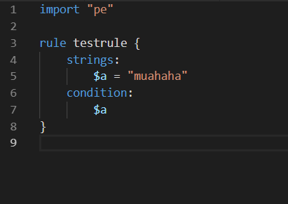
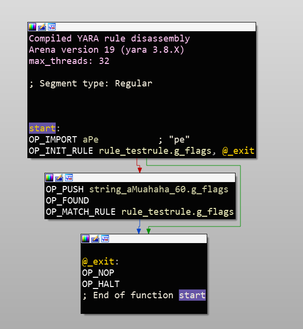

# Compiled YARA Rules Processor for IDA

Loader and processor for YARA's compiled rule format





## Installation 
put the processor plugin in:
```xml
<IDA_INSTALL_DIR>\procs\
```
put the file loader in:
```xml
<IDA_INSTALL_DIR>\loaders\
```

## Requirements
- IDA 7.0

## Tested Versions
- YARA 3.7.0
- YARA 3.8.1


## License
[MIT](https://opensource.org/licenses/MIT) 2018 [@bnbdr](https://github.com/bnbdr/)
